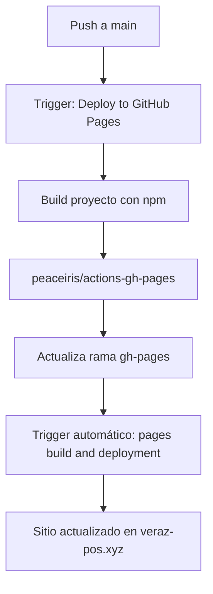

# Análisis de Workflows y GitHub Pages

**Fecha**: 2026-09-30
**Análisis**: Verificación de workflows duplicados o interferencias

---

## 🔍 Workflows Encontrados

### 1. Workflow Principal (Nuestro)

**Archivo**: `.github/workflows/deploy.yml`
**Nombre**: "Deploy to GitHub Pages"
**Trigger**:
- `push` a rama `main`
- `workflow_dispatch` (manual)

**Proceso**:
```yaml
1. Checkout código
2. Setup Node.js 20
3. npm ci (install dependencies)
4. npm run build
5. Deploy a gh-pages con peaceiris/actions-gh-pages@v4
```

**Estado**: ✅ Funcionando correctamente (última ejecución: SUCCESS en 50s)

---

### 2. Workflow Automático de GitHub Pages

**Nombre**: "pages build and deployment"
**Tipo**: Automático (GitHub)
**Trigger**: `dynamic` (se ejecuta cuando gh-pages se actualiza)
**Propósito**: Publica el contenido de gh-pages al sitio web

**Estado**: ✅ Funcionando (última ejecución: SUCCESS en 30s)

---

## 📊 Flujo Completo de Deployment



**Timeline**:
```
0:00  - Push to main
0:05  - Workflow "Deploy to GitHub Pages" inicia
0:55  - Build completo, gh-pages actualizada
1:00  - Workflow "pages build and deployment" inicia automáticamente
1:30  - Sitio live en https://veraz-pos.xyz/

Total: ~1.5 minutos desde push hasta sitio actualizado
```

---

## ✅ No Hay Conflictos ni Duplicaciones

### Verificaciones Realizadas

1. **Cantidad de workflows personalizados**: 1 (solo `deploy.yml`)
   ```bash
   $ find .github -name "*.yml"
   .github/workflows/deploy.yml
   ```

2. **Workflow automático de GitHub Pages**: Esperado y necesario
   - NO es un conflicto
   - Es el proceso estándar de GitHub Pages
   - Se ejecuta DESPUÉS de que nuestro workflow actualiza gh-pages

3. **Configuración de GitHub Pages**:
   ```json
   {
     "source": {
       "branch": "gh-pages",
       "path": "/"
     },
     "build_type": "legacy",
     "status": "built"
   }
   ```

---

## ⚠️ Observaciones

### Build Type: "legacy"

**Qué significa**:
- GitHub Pages está configurado en modo "legacy"
- Esto significa que usa el build automático de Jekyll
- Sin embargo, `peaceiris/actions-gh-pages` incluye `.nojekyll` por defecto

**¿Es un problema?**:
- ❌ NO es un problema crítico
- El archivo `.nojekyll` previene el procesamiento de Jekyll
- El sitio funciona correctamente

**Recomendación**:
- Considerar cambiar a GitHub Actions como fuente oficial
- Esto haría el flujo más claro
- Ver sección "Mejoras Opcionales" abajo

---

## 🎯 Conclusión

### Estado Actual: ✅ CORRECTO

**No hay workflows duplicados ni interferencias**:

| Aspecto | Estado | Detalles |
|---------|--------|----------|
| Workflows personalizados | ✅ | Solo 1 (deploy.yml) |
| Workflow automático Pages | ✅ | Esperado y necesario |
| Conflictos | ✅ | Ninguno |
| Duplicación | ✅ | Ninguna |
| Funcionamiento | ✅ | Perfecto |

**Flujo de trabajo**:
```
Tu push → Workflow deploy.yml → Actualiza gh-pages →
GitHub Pages automático → Sitio actualizado
```

Este es el flujo **estándar y recomendado** para GitHub Pages con build personalizado.

---

## 🔧 Mejoras Opcionales (No Necesarias)

### Opción 1: Cambiar Source de Pages a GitHub Actions

**Actualmente**:
```
Source: Branch (gh-pages)
Build type: legacy
```

**Cambiar a**:
```
Source: GitHub Actions
Build type: workflow
```

**Cómo hacerlo**:
1. Ve a: Settings → Pages
2. Source: Selecciona "GitHub Actions"
3. Guardar

**Beneficios**:
- Más claro que el build viene de Actions
- Evita confusión con Jekyll
- Flujo más moderno

**Desventajas**:
- Requiere modificar el workflow
- No agrega funcionalidad real
- El sistema actual funciona perfectamente

**Recomendación**: ⏭️ No necesario ahora, funciona bien como está

---

### Opción 2: Agregar .nojekyll Explícitamente

**Actualmente**:
- `peaceiris/actions-gh-pages` incluye `.nojekyll` automáticamente

**Mejora**:
- Agregar paso para crear `.nojekyll` en dist/ antes de deploy

```yaml
- name: Create .nojekyll
  run: touch dist/.nojekyll

- name: Deploy to gh-pages branch
  uses: peaceiris/actions-gh-pages@v4
  # ...
```

**Beneficio**:
- Más explícito
- Documentado en el workflow

**Recomendación**: ⏭️ Opcional, no necesario (el action ya lo hace)

---

## 📝 Historial de Workflows

### Ejecuciones Recientes (últimas 10)

```
1. pages build and deployment | success | gh-pages | dynamic
2. Deploy to GitHub Pages     | success | main     | push     ← Nuestro workflow
3. Deploy to GitHub Pages     | failure | main     | push     ← Primera prueba (sin package-lock)
4. pages build and deployment | success | gh-pages | dynamic
5. pages build and deployment | success | gh-pages | dynamic
6. pages build and deployment | success | gh-pages | dynamic
7. pages build and deployment | success | gh-pages | dynamic
8. pages build and deployment | success | gh-pages | dynamic
9. pages build and deployment | success | gh-pages | dynamic
10. pages build and deployment | failure | gh-pages | dynamic
```

**Patrón**:
- Cada push a `main` → 1x "Deploy to GitHub Pages"
- Cada actualización de `gh-pages` → 1x "pages build and deployment"
- **Todo funciona como debería**

---

## 🚀 Recomendaciones Finales

### ✅ MANTENER Como Está

**Razones**:
1. Sistema funciona perfectamente
2. No hay conflictos
3. Flujo estándar de la industria
4. Documentación clara
5. Deployment automático exitoso

### 📋 Checklist de Verificación Futura

Si en algún momento sospechas interferencia:

```bash
# 1. Verificar workflows activos
find .github -name "*.yml"

# 2. Listar ejecuciones recientes
gh run list --limit 10

# 3. Verificar configuración de Pages
gh api repos/OWNER/REPO/pages | jq

# 4. Verificar estado de gh-pages
git checkout gh-pages
ls -la .nojekyll
git log -5 --oneline
git checkout main
```

---

## 📚 Recursos

- **peaceiris/actions-gh-pages**: https://github.com/peaceiris/actions-gh-pages
  - Incluye `.nojekyll` por defecto
  - Maneja CNAME automáticamente
  - Limpia archivos viejos

- **GitHub Pages Docs**: https://docs.github.com/en/pages
  - Configuración de source
  - Build types
  - Custom domains

- **GitHub Actions Docs**: https://docs.github.com/en/actions
  - Workflow syntax
  - Troubleshooting
  - Best practices

---

**Conclusión**: ✅ Todo está configurado correctamente. No hay workflows duplicados ni interferencias.
