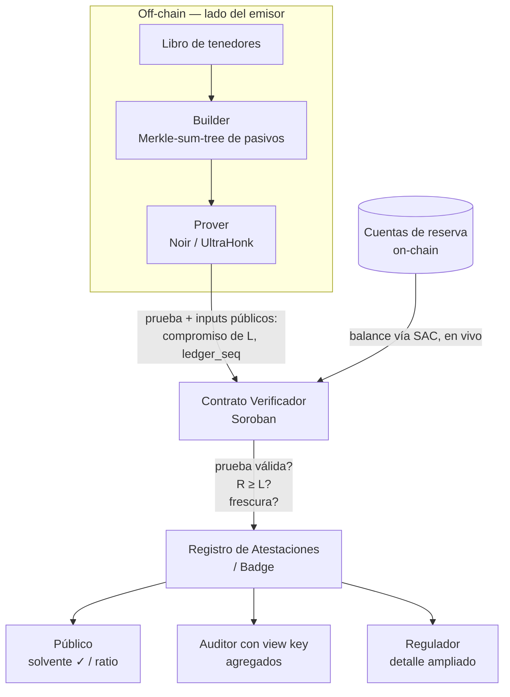

# Proof of Solvency privado para emisores en Stellar

**Arquitectura completa — documento "norte"**
*Versión 0.1 — documento vivo. Guía el build y es la base de la futura aplicación a SCF Open Track.*

> Nombre de trabajo: **Veraz** (placeholder). Posicionamiento de una línea:
> *"Chainlink Proof of Reserves, pero privado, criptográfico y nativo de Stellar."*

---

## 1. Qué es, en una frase

Una primitiva que permite a un emisor de stablecoin o RWA **probar criptográficamente que es solvente** — que sus reservas cubren sus pasivos — **sin exponer los saldos individuales de sus tenedores**, con la prueba atada al estado actual del ledger y con divulgación selectiva por niveles (público / auditor / regulador).

No es una app de un solo uso: es **infraestructura componible**. Un emisor apunta sus cuentas de reserva y su token, y obtiene una atestación de solvencia verificable on-chain que cualquiera puede consultar.

---

## 2. El problema y por qué importa

Todo emisor de activo respaldado tiene una obligación estructural permanente: demostrar respaldo. Hoy eso se resuelve con **attestations de terceros** (modelo Tether/Circle): auditorías periódicas, basadas en confianza, que son una foto de un momento puntual. El propio SCF exige a los emisores fiat-backed "un URL a una auditoría de terceros o prueba de reservas suficientes" — es decir, Stellar ya impone este requisito, pero resuelto con el modelo viejo.

La versión criptográfica mejora tres cosas a la vez:

- **Confianza:** la solvencia se demuestra con matemática verificable, no con la palabra de una auditora.
- **Frescura:** la prueba es en vivo contra el ledger, no una foto trimestral.
- **Privacidad:** se prueba la relación reservas ≥ pasivos sin filtrar los libros del emisor ni los saldos de sus tenedores.

---

## 3. El núcleo conceptual: solvencia = reservas ≥ pasivos

```
Solvencia  ⟺  Reservas (R)  ≥  Pasivos (L)
```

- **Reservas (R) — el lado público y fácil.** Son los activos que el emisor mantiene en cuentas Stellar conocidas. Estos balances son públicos on-chain, así que el contrato verificador los **lee en vivo** vía el Stellar Asset Contract (`balance(account)`). No requieren ZK: su valor está en ser frescos y leídos directamente del ledger en el momento de verificar.

- **Pasivos (L) — el lado difícil y donde vive el foso.** Es el total que el emisor le debe a sus tenedores. La parte valiosa es probar que `L ≤ R` **sin revelar los saldos individuales** (ni, opcionalmente, el valor exacto de `L`). Aquí entra el ZK, mediante un **Merkle-sum-tree** de los pasivos.

### 3.1 El Merkle-sum-tree de pasivos

Se construye un árbol de Merkle donde:

- Cada **hoja** = compromiso al saldo de un tenedor (`hash(saldo, sal)` con Poseidon2).
- Cada **nodo interno** lleva la **suma** de los saldos de sus hijos, además del hash.
- La **raíz** lleva el total de pasivos `L` y un hash que ancla toda la estructura.

El circuito ZK prueba, sin revelar las hojas:

1. **Buena formación:** la suma de cada nodo = suma de sus hijos (consistencia aritmética del árbol).
2. **No-negatividad:** cada saldo de hoja es ≥ 0 (range check). *Esto es crítico de seguridad* — sin esta restricción es posible el "dummy user attack" (inyectar saldos negativos para falsear el total). Es exactamente la clase de vulnerabilidad documentada en implementaciones previas (Binance), y la defendemos explícitamente.
3. **Total declarado:** la raíz suma exactamente el `L` comprometido.
4. **Frescura:** el `ledger_seq` al que corresponde el snapshot es un input público.

Luego, **en el contrato**, se cierra la relación de solvencia: el contrato lee `R` en vivo, recibe el `L` probado, y verifica `R ≥ L` + que `ledger_seq` sea reciente + que la prueba sea válida.

---

## 4. Arquitectura de componentes (modular por diseño)

El sistema se divide en módulos con interfaces limpias. La modularidad **no es estética**: es lo que mantiene abierta la puerta de la Integration Track a futuro (un wallet, anchor o vault de DeFi puede envolver el motor sin reescribirlo) y lo que permite reemplazar piezas (p. ej. token transparente → token confidencial) sin tocar el resto.



### Módulo 1 — Liabilities Commitment Builder *(off-chain)*
Toma el libro de tenedores del emisor y construye el Merkle-sum-tree: compromisos de hoja, sumas internas, raíz. Salida: la raíz + el testigo (witness) para el prover. Determinístico y auditable.

### Módulo 2 — Solvency Prover *(off-chain)*
Circuito Noir + proving con Barretenberg (UltraHonk). Genera la prueba de que el árbol está bien formado, los saldos son no-negativos, y la raíz suma `L`. Puede correr **client-side en WASM** (como el PoC de Private Payments de la SDF) o del lado del emisor.

### Módulo 3 — Contratos on-chain, en **tres capas** *(Soroban)*
Siguiendo el patrón "verificador / política / aplicación" que recomienda la skill de ZK (separar concerns reduce la superficie de auditoría y facilita upgrades):

- **Capa 1 — Verifier.** Valida *solo* la prueba criptográfica UltraHonk contra los inputs públicos. VK fija al deploy. No conoce nada de solvencia. Se **reutiliza** del wrapper de Nethermind.
- **Capa 2 — Policy.** La lógica de negocio. Lee las reservas `R` en vivo vía SAC `balance()`, llama a la Capa 1 (cross-contract), comprueba `R ≥ L`, la frescura y el anti-replay, y emite el resultado. Aquí vive el compliance.
- **Capa 3 — Registry.** Guarda la atestación y la expone a consulta pública. En el MVP va fusionada con la Capa 2; se separa al escalar a multi-emisor.

### Módulo 4 — Attestation Registry / Badge *(la interfaz componible de la Capa 3)*
Un emisor se registra (declara cuentas de reserva + token). El registro expone una consulta pública:
`is_solvent(issuer) → { solvente: bool, ratio_bucket, ledger_seq, timestamp }`.
Esto es lo que cualquier wallet, explorador o contraparte enchufa. Es la pieza que convierte el proyecto en infraestructura, no en demo.

### Módulo 5 — Disclosure Module *(view keys)*
Implementa la divulgación selectiva por niveles cifrando los agregados bajo claves de visualización:
- **Público:** ve solo `solvente: sí` + bucket de ratio (≥100%, ≥110%…). No ve `L` exacto ni los tenedores.
- **Auditor (view key):** desencripta los agregados — `L` total, composición de reservas por activo, número de tenedores.
- **Regulador (clave ampliada / cooperación del emisor):** detalle por tenedor.

Esto es, literal, la estrategia "viewing keys para divulgación selectiva" que la SDF declara como su norte de privacidad compliance-first.

### Módulo 6 — Client SDK / UI
Para que el emisor genere pruebas y para que el público/verificadores consulten el badge. Capa fina sobre los módulos 1–5.

---

## 5. Flujo de punta a punta

1. El emisor construye el Merkle-sum-tree de sus pasivos al ledger `S` *(off-chain, Módulo 1)*.
2. Genera la prueba ZK: árbol bien formado + saldos ≥ 0 + raíz = `L` + `ledger_seq = S` *(Módulo 2)*.
3. Envía `prueba + inputs públicos (compromiso de L, S)` al Contrato Verificador *(Módulo 3)*.
4. El contrato lee `R` en vivo desde las cuentas de reserva, verifica la prueba, comprueba `R ≥ L` y que `S` sea reciente.
5. Si todo pasa, actualiza el Registro de Atestaciones *(Módulo 4)*.
6. El público consulta el badge; el auditor usa su view key para ver agregados *(Módulo 5)*.

---

## 6. Stack técnico

| Capa | Elección | Por qué |
|---|---|---|
| Circuitos | **Noir** 1.0.0-beta.9 + Barretenberg 0.87.0 (UltraHonk) | Legible (tipo Rust), y reutiliza la maquinaria Merkle Poseidon2 + patrones de range/lookup del repo `rs-soroban-ultrahonk`. UltraHonk es fuerte en range/lookup, justo lo que pide la no-negatividad. |
| Curva | **BN254** | Default de Noir/bb; Protocolo 25/26 añadió host functions BN254 que abaratan la verificación on-chain. |
| Contrato | **Soroban** (Rust, `soroban-sdk`) | Construido sobre el wrapper verificador UltraHonk; lee balances vía SAC. |
| Proving | **WASM client-side** o lado-emisor | Sigue el patrón del PoC de Private Payments de la SDF. |
| Hash | **Poseidon2** | ZK-friendly, nativo en Stellar desde X-Ray. |

Piezas base a reutilizar (no reinventar — alineado con lo que premia el SCF):
- `rs-soroban-ultrahonk` (Nethermind): wrapper verificador + Merkle Poseidon2 + circuitos range/lookup de referencia.
- Stellar Asset Contract para lectura de balances de reserva.

---

## 7. Modelo de confianza y seguridad

- **No-negatividad de saldos (range checks):** defensa explícita contra el dummy-user attack. Diferenciador y punto de seguridad central.
- **Control de las cuentas de reserva:** en el MVP, las reservas se leen de cuentas declaradas por el emisor (se confía en el registro). Endurecimiento: exigir autorización/firma desde las cuentas de reserva para probar control real, no solo existencia de saldo.
- **Frescura + anti-replay persistido:** la prueba se ata a `ledger_seq` y se rechaza si el snapshot está fuera de una ventana reciente. Además se **persiste un guard** (el último `ledger_seq` verificado) para que una misma prueba no se reenvíe dentro de la ventana — no basta con la ventana de frescura. Las reservas, al leerse en vivo, siempre son actuales.
- **Soundness del SNARK:** garantía estándar de que no se puede generar una prueba válida de un enunciado falso.
- **Dónde el ZK es load-bearing (honestidad):** ver §8.

---

## 8. Dónde el ZK es realmente esencial (caso honesto)

Es la pregunta más importante y la respondemos de frente, porque la Open Track exige análisis de mercado y diferenciación reales:

- En una stablecoin **transparente**, los saldos de los tenedores ya son públicos on-chain, así que el total de pasivos es derivable. En ese caso el ZK aporta **privacidad de la composición** (no itemizar tenedores), una atestación limpia y verificable, y frescura — útil, pero no imprescindible.
- El ZK se vuelve **inevitable** cuando:
  - **(a) El token es confidencial** (balances ocultos) → los pasivos *no* son públicos → probar `L ≤ R` exige ZK. Este es el combo de mayor valor y está en el roadmap (los confidential tokens son hoy prototipo de la SDF).
  - **(b) Hay pasivos o reservas off-chain / multi-cuenta** que el emisor no quiere itemizar.
  - **(c) El emisor quiere revelar solo "solvente / ratio"** y nada más.

**Conclusión de diseño:** construimos para que sea útil ya en el caso transparente (divulgación selectiva + atestación verificable + frescura) y **esencial** en el caso confidencial (roadmap). La arquitectura modular hace que pasar de uno a otro sea cambiar la fuente de pasivos, no reescribir el sistema.

---

## 9. Roadmap completo (sin recortes)

1. **Fuente de pasivos intercambiable (token → RWA → custodio):** el MVP prueba solvencia de un **token** (caso más nítido y demoable). El mismo motor —el contrato verifica una desigualdad "suma privada de obligaciones ≤ reservas", no "un token"— acepta otras fuentes cambiando solo el adaptador del Módulo 1: posiciones de inversores en un **fondo RWA tokenizado**, saldos de clientes de un **custodio/exchange** (el caso clásico post-FTX, sin necesidad de emitir token), u obligaciones off-chain vía atestación. El encuadre del producto es "proof of solvency para **emisores**", no "para el token USDX".
2. **Pruebas de inclusión por tenedor:** cada tenedor verifica que *su* saldo entró en el `L` probado (inclusión Merkle). Pasa de "confía en el agregado" a verificable individualmente.
3. **Integración con confidential tokens:** pasivos genuinamente ocultos → ZK esencial. El combo de máximo valor.
4. **Multi-activo con haircuts / ratios de colateral:** reservas en varios activos con factores de descuento (patrón de tiers tipo Binance).
5. **Pruebas recursivas / agregadas:** batch de muchos tenedores en una prueba, para escalar costo y tamaño on-chain.
6. **Atestación de reservas off-chain:** reservas bancarias fiat vía oráculo/atestación, para emisores fiat-backed.
7. **Acto 2 — Integration Track:** versión productizada que un emisor/anchor real integra con DeFindex o un ramp de la lista oficial. *Aplicación SCF distinta, a futuro, con tracción.*

---

## 10. Encaje con SCF Open Track (mapa a tranches)

> Para el primer grant, el encaje correcto es **Open Track** (primitiva novedosa, no integración). El cuello de botella no es la idea — es demostrar equipo y tracción. El hackathon es la herramienta para empezar a construir ambos: su resultado es, casi literal, el Tranche 1.

| Tranche | Contenido | Estado |
|---|---|---|
| **1 — MVP** | Circuito de pasivos + contrato verificador + chequeo de solvencia en testnet, token transparente, divulgación básica. | ≈ el slice del hackathon, madurado. |
| **2 — Testnet** | Registro de atestaciones, divulgación por niveles con view keys, inclusión por tenedor, piloto con un emisor real. | |
| **3 — Mainnet** | SDK productizado, soporte de confidential tokens, auditoría, lanzamiento en mainnet. | |

Cómo este diseño satisface los criterios clave de la Open Track:
- **Primitiva novel + diferenciación:** la pata de pasivos + divulgación selectiva, donde el resto clona el range proof commodity.
- **Necesidad validada:** emisores/RWA dominaron el SCF #43; el propio SCF ya exige proof-of-reserves a emisores fiat-backed (con el modelo viejo).
- **Integración Stellar significativa:** lectura de reservas vía SAC + verificación de prueba on-chain; no es almacenamiento superficial.
- **Plan de open-source:** contratos open-source desde el día 1.
- **Aprovecha tooling existente:** reutiliza el verificador UltraHonk de Nethermind y primitivas nativas (Poseidon2, BN254).

---

## 11. Riesgos abiertos (a vigilar)

- **Colisión:** PoR es una idea obvia; la defensa es que la diferenciación (pasivos + divulgación) se entienda rápido y no quede enterrada.
- **Dependencia de una tendencia:** el valor pleno de privacidad depende de que el mundo confidential-token avance (la SDF empuja fuerte, pero aún no está en producción).
- **Control de reservas:** leer un balance ≠ probar control de la cuenta; endurecer en Tranche 2.
- **Demo product-first:** el relato no puede irse a la matemática del Merkle-sum-tree; el juez/lector no técnico tiene que entender el valor en el primer minuto.
