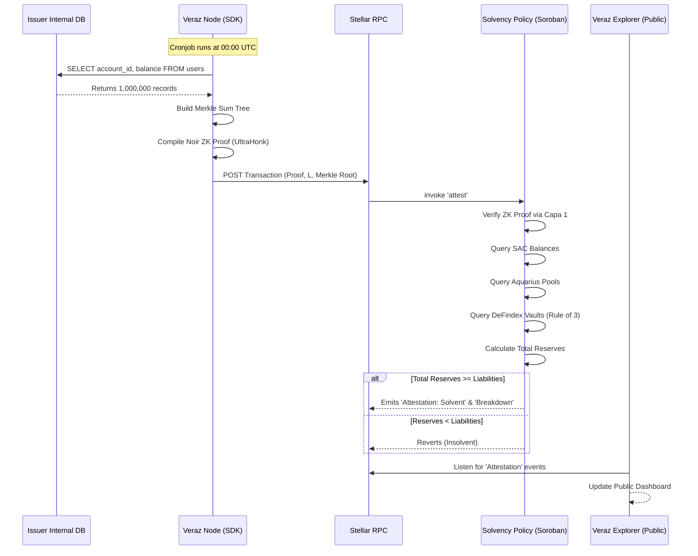

# Veraz Protocol: Deep Technical Architecture & Data Flows
**Version:** 1.0 (Hackathon PoC & Production Target)
**Status:** In Development (Testnet Deployed)

---

## 1. Executive Summary & Architectural Tenets

Veraz is a decentralized Proof of Solvency (PoS) infrastructure native to the Stellar and Soroban ecosystem. Unlike legacy PoS solutions that only read cold wallet balances (SAC), Veraz introduces **Multi-Venue Reserve Aggregation**, allowing modern stablecoin issuers and real-world asset (RWA) tokenizers to prove solvency even when their reserves are deployed across decentralized finance (DeFi) protocols to generate yield or liquidity.

### Core Tenets
1. **Zero-Knowledge Privacy:** Liabilities (user balances) are never exposed publicly. They are aggregated into a Merkle Sum Tree, and a Zero-Knowledge proof (Noir/UltraHonk) mathematically guarantees that the sum matches the reported total.
2. **On-Chain Autonomous Verification:** Smart contracts on Soroban act as independent verifiers. There are no trusted off-chain oracles; the contract reads blockchain state natively.
3. **DeFi Composability:** Reserves are calculated by summing standard Stellar assets (SAC), Aquarius AMM Liquidity Pool shares, and DeFindex Yield Vault allocations via standard cross-contract calls.

---

## 2. Current System Architecture (Hackathon PoC)

The current state of Veraz is a highly functional Proof of Concept deployed on the Stellar Testnet. It demonstrates the full cryptographic and smart contract flow, executing ZK proving in the browser.

### 2.1. High-Level Topology

```mermaid
graph TD
    subgraph Frontend Client (React/Vite)
        UI[Issuer / Auditor UI]
        Noir[Noir JS / Barretenberg]
        MT[Merkle Tree Builder]
        UI -->|Liabilities| MT
        MT -->|Root, Sum| Noir
        Noir -->|UltraHonk Proof| Freighter[Freighter Wallet]
    end

    subgraph Stellar Network (Soroban)
        Freighter -->|Invoke 'attest'| Policy(Solvency Policy Contract)
        Policy -->|Cross-Contract| Verifier(UltraHonk Verifier)
        Policy -->|Read Balance| SAC(Stellar Asset Contract)
        Policy -->|Cross-Contract| Aqua(Aquarius AMM)
        Policy -->|Cross-Contract| Defi(DeFindex Vaults)
    end
```

### 2.2. The Frontend Client (State & Flow)

The frontend currently serves a dual purpose: a testing ground for issuers to generate proofs and a dashboard for auditors to verify them.

#### The Prover Module (`src/lib/prover.js`)
The `generateSolvencyProof` function is the core of the client-side cryptography:
1. **Merkle Tree Construction:** Accepts a hardcoded array of `N=8` balances and salts. It builds a Merkle Sum Tree in JavaScript.
2. **Circuit Execution:** Uses `@noir-lang/noir_js` to execute the circuit defined in `solvency.json`. It passes the `root`, `total_liabilities`, `ledger_seq`, `balances`, and `salts` as witnesses.
3. **UltraHonk Backend:** Uses `@aztec/bb.js` (`UltraHonkBackend`) with `keccak: true` to generate a lightweight proof compatible with the Soroban EVM-like verifier.
4. **Byte Alignment (Soroban ABI):** This is a critical technical detail. The `bb.js` library outputs public inputs, but Soroban expects a strict 96-byte array layout. The frontend manually formats the `publicInputs`:
   - `[0..32]`: `root` (32 bytes, Field Element BE)
   - `[32..64]`: `liabilities` padded to i128 BE (16 bytes of padding + 16 bytes payload)
   - `[64..96]`: `ledger_seq` padded to u32 BE (28 bytes of padding + 4 bytes payload)

---

## 3. Smart Contract Deep Dive (Soroban Ecosystem)

The heart of Veraz lies in its smart contracts deployed on the Stellar network. The current implementation resides primarily in the `solvency_policy` contract.

### 3.1. `solvency_policy/src/lib.rs` (The Orchestrator)

This contract fuses Layer 2 (Solvency Logic) and Layer 3 (Public Attestation). 

#### State & Storage (`Config` and `Attestation`)
The contract stores a `Config` struct initialized by the deployer:
- `verifier`: The address of the Capa 1 UltraHonk verifier.
- `reserve_sac`: The underlying stablecoin asset contract (e.g., USDC).
- `reserve_accounts`: The institutional wallets holding the reserves.
- `freshness_window`: Maximum allowed lag between the liability snapshot and the current ledger.
- `aquarius_pools`: Vector of AMM pool addresses.
- `defindex_vaults`: Vector of Yield Vault addresses.

The `Attestation` struct persists the results of the solvency check, including a detailed breakdown: `sac_balance`, `aquarius_balance`, and `defindex_balance`.

#### The `attest` Function Logic Flow
When an issuer submits a proof, the `attest(public_inputs, proof)` function executes:

1. **Public Input Parsing:** 
   Extracts `L` (Liabilities) and `snap_seq` (Ledger Sequence of the snapshot) from the strict 96-byte array described in the frontend section.
2. **Freshness & Anti-Replay Mechanisms:**
   - Validates `current_seq - snap_seq <= freshness_window` to ensure the liability data isn't stale (StaleProof Error).
   - Validates `snap_seq > last_seq` to prevent replay attacks using old proofs (Replay Error).
3. **Cryptographic Verification (Capa 1):**
   - Invokes the `verifier` contract. If the proof is mathematically invalid, the verifier traps/panics, and the entire transaction reverts automatically.
4. **Reserve Aggregation (Multi-Venue Data Ingestion):**
   - **SAC Reading:** Iterates over `reserve_accounts` calling `token.balance(&acct)`.
   - **Aquarius Reading:** Delegates to the `aquarius::read_aquarius_reserves` module.
   - **DeFindex Reading:** Delegates to the `defindex::read_defindex_vaults` module.
5. **Solvency Evaluation:**
   - Evaluates `total_reserves >= l_value`. 
   - Generates the `Attestation` struct.
6. **Event Emission:**
   - Publishes two events: `solvency` (boolean result) and `breakdown` (the detailed numbers for SAC, Aquarius, DeFindex, and Total).

### 3.2. AMM Integration: `aquarius.rs`

Aquarius pools represent decentralized liquidity. When an issuer provides liquidity, their assets are locked, and they receive LP (Liquidity Provider) shares. 

**Logic:**
1. The contract iterates over `aquarius_pools`.
2. For each pool, it queries the `share_id` (the specific token contract representing the pool shares).
3. It queries the `balance` of the `share_id` for the issuer's address.
4. It safely sums these raw shares (`checked_add`).
*Note on Current State:* The PoC currently accepts raw shares as a 1:1 proxy for value to minimize compute. In production, this will apply the pool's invariant curve to calculate the exact underlying withdrawal value.

### 3.3. Yield Integration: `defindex.rs`

DeFindex allows issuers to deposit idle reserves into Yield Vaults. This integration requires converting vault shares back into their underlying asset value.

**Logic (The Rule of Three):**
1. Iterates over `defindex_vaults`.
2. Queries the user's `balance` of vault shares.
3. Queries the vault's `total_supply` of shares.
4. Queries `fetch_total_managed_funds()` to determine the Total Value Locked (TVL) in the vault.
5. Applies checked arithmetic: `asset_value = (user_shares * total_assets) / total_supply`.
6. Handles complex return types dynamically, extracting the first asset's allocation.

---

## 4. Target Architecture (Production / Enterprise V2)

While the PoC relies on a React frontend to generate proofs from a hardcoded list of 8 users, an enterprise product cannot operate this way. The target architecture transforms Veraz from a web tool into **Enterprise Infrastructure**.

### 4.1. The Shift: Web App to Veraz Node (SDK)

In production, Exchanges and Issuers will not paste JSON data into a website. The liability data is highly sensitive and massive (millions of rows).

**Veraz SDK (`@veraz-protocol/node`)**:
A Node.js/Rust daemon that the issuer installs inside their secure VPN/VPC. 
- **Data Ingestion:** The SDK exposes hooks to connect directly to the issuer's internal PostgreSQL/MySQL database.
- **Local Proving:** The SDK reads the user balances, constructs a massive Merkle Tree (Depth > 20), and executes the Barretenberg prover natively using server CPU/RAM.
- **Privacy Guarantee:** The raw database data NEVER leaves the server. Only the 96-byte `public_inputs` and the UltraHonk `proof` byte array are exported.
- **Automated Submission:** The SDK signs the Soroban transaction using a configured treasury keypair and submits the attestation automatically via a Cronjob (e.g., every 6 hours).

### 4.2. Target Data Flow Diagram



### 4.3. The Individual Verification Upgrade (The Holy Grail)

Once the Merkle Tree supports thousands of users, the Veraz Public Explorer will transition from just showing "Solvent / Insolvent" to offering Individual Verification.

1. The Veraz Node (SDK) generates a `Merkle Receipt` (the sibling nodes required to reach the root) for every individual user and stores it in the exchange's database.
2. The user logs into the exchange, sees their receipt, and copies it.
3. The user goes to `explorer.veraz.com`, pastes their receipt and balance.
4. The Explorer recalculates the hash path and compares it to the `Merkle_Root` published on the Stellar ledger in the latest Attestation.
5. This mathematically proves to the user that their specific funds were included in the total liabilities, eliminating the possibility of the exchange keeping "off-the-books" debt.

---

## 5. Security & Scalability Considerations

### 5.1. Smart Contract Constraints & Overflows
- All additions in `solvency_policy`, `aquarius`, and `defindex` utilize `checked_add`, `checked_mul`, and `checked_div`. In the event of a theoretical token overflow (e.g., massive hyperinflation of an asset), the contract will panic rather than calculate a false positive solvency.
- **Cross-Contract Trust:** The contract blindly trusts the addresses provided in `aquarius_pools` and `defindex_vaults`. In production, the `initialize` function must be protected by an admin multi-sig, or the list of approved DeFi protocols must be whitelisted by a DAO to prevent an issuer from deploying a malicious "fake pool" that reports infinite reserves.

### 5.2. Proof Freshness Vulnerabilities
If the `freshness_window` is too large, an issuer could take a snapshot of liabilities during a low-activity period, wait for reserves to accumulate, and attest a falsely positive ratio. The parameter is currently configurable, but in production, it should be enforced tightly (e.g., `100 ledgers` ~ 8-10 minutes) to ensure the liability snapshot and the on-chain reserve reading occur practically simultaneously.

---

## 6. Deep Dive into Data Privacy (Zero-Knowledge)

### 6.1. Why Noir & UltraHonk?
The protocol chose Noir over other ZK-DSLs (like Circom) due to its modern Rust-like syntax and strict typing, minimizing constraint-writing errors.
The backend chosen is **UltraHonk** (from Barretenberg). UltraHonk is a modern Plonk-based proving system that:
1. Offers extremely fast proving times on consumer hardware.
2. Generates succinct proofs that are cheap to verify on-chain.
3. Does not require a trusted setup per-circuit (Universal SRS), which is critical for an infrastructure provider where every issuer might need slightly different circuit sizes based on their user base.

### 6.2. Privacy Guarantees
- **Hiding Property:** The balances and user IDs (salts) provided in the private inputs are completely opaque. The Merkle root is computationally infeasible to reverse-engineer.
- **No Negative Balances:** The circuit strictly enforces `assert(balance >= 0)`. This prevents a malicious issuer from inserting a "fake" user with a balance of `-1,000,000 USDC` to artificially deflate their total liabilities.

---

## 7. Risk Analysis & Threat Modeling

A decentralized infrastructure must account for severe edge cases.

### 7.1. Database Breach (Liability Side)
If an exchange's private database is breached, the Veraz Protocol remains unaffected. The Veraz SDK runs locally and does not expose API keys. The only risk is if the attacker modifies the database records right before the Cronjob runs, forcing the exchange to publish an incorrect `Merkle Root`. However, since individual users can verify their receipts, the fraud would be detected immediately by the community.

### 7.2. Sybil & Padding Attacks
To maintain a balanced Merkle Tree (which requires $2^N$ leaves), the SDK automatically pads the database with "dummy" accounts (balance = 0). The circuit treats these mathematically identical to real users. There is zero risk of inflation, but the proving time increases logarithmically $O(log N)$.

### 7.3. On-Chain Denial of Service (DoS)
If the Stellar network experiences severe congestion, the `Attestation` transaction might fail to land within the `freshness_window`. The Veraz SDK is designed to handle this by automatically regenerating a fresh proof with an updated `ledger_seq` if the transaction is dropped from the mempool.

---

## 8. Multi-Asset & RWA Proof of Solvency (Roadmap)

The current implementation proves solvency for a single asset (e.g., USDC reserves vs USDC liabilities). 
The architecture is designed to scale horizontally to Multi-Asset Proof of Solvency:

1. **Price Oracles Integration:** The `Solvency_Policy` will integrate with on-chain oracles (e.g., Band Protocol on Stellar) to normalize all reserves into a single base currency (e.g., USD).
2. **Formula Upgrade:** `Total_Reserves = (SAC_BTC * Price_BTC) + (SAC_ETH * Price_ETH) ...`
3. **RWA Tokenization:** For RWAs, the liabilities are public (Total Supply of the RWA token on Stellar). The reserves would be tracked via specialized custodian API integrations bridged on-chain, eliminating the need for ZK liabilities and drastically simplifying the circuit.

---

## 9. Economics & Gas Optimization (Soroban)

Verifying ZK proofs on-chain is computationally expensive.
- **Verification Cost:** The UltraHonk verifier consumes significant Soroban compute units (instructions).
- **Storage Cost:** The `Attestation` struct is stored directly on the ledger. We utilize `extend_ttl` to ensure the attestation doesn't get archived prematurely, keeping the data available for the Public Explorer.
- **Sponsorship:** In production, the Veraz SDK will wrap the transaction in a fee-bump or utilize an enterprise sponsor account, ensuring the issuer's main treasury doesn't leak dust for transaction fees.

---
*Document Last Updated: June 2026*  
*Target: PULSO Hackathon & Production Roadmap*
